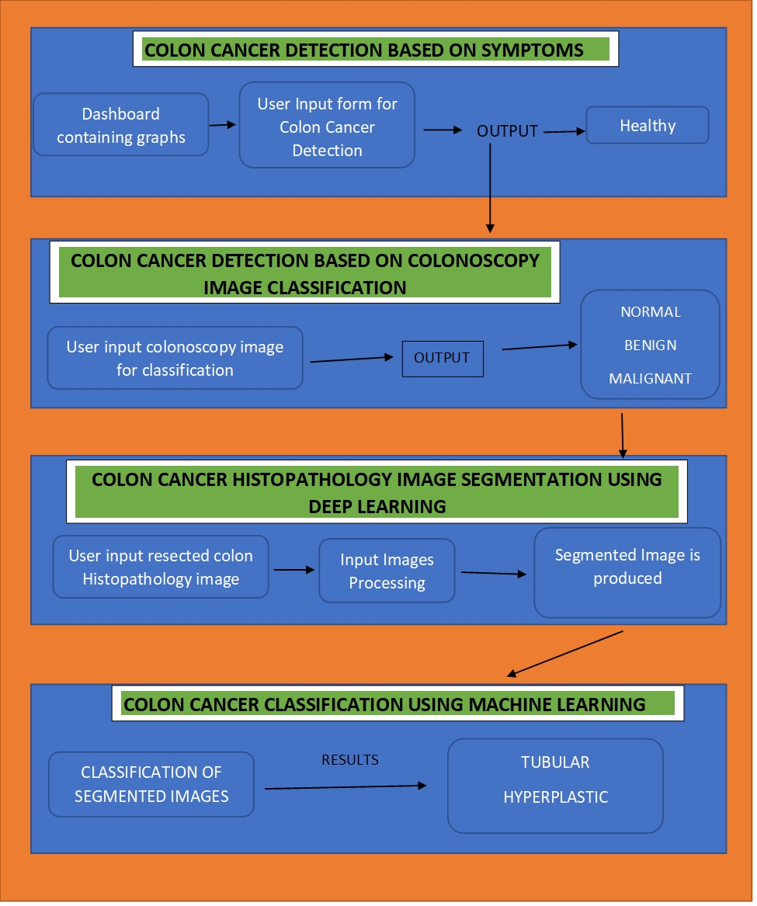

# Capstone-Project-Repository
Final Year Project.

# ML AND DL AIDED COLON CANCER DIAGNOSIS

## Supervisors

1. Prof. Bulent Yılmaz
2. Refika Sultan Doğan

## Students

1. Tajudeen Lukuman Aleru
2. Amir Shemsu Lale
3. Nehlin Shariat

## Flowchart

</img>

# Progress

## Current Result Analysis and Interpretation

